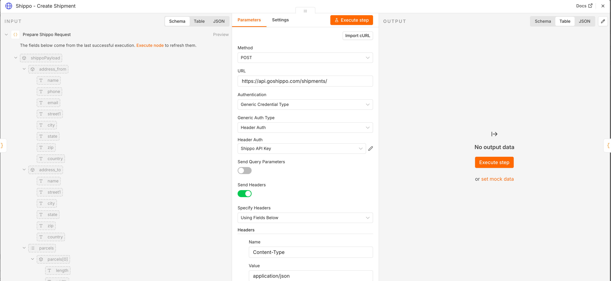

# 🔄 CargoFlow - n8n Workflow Automation Expert

**Production-Ready Logistics Automation | 3 Complex n8n Workflows**

[GitHub Repository](your-repo-url) | [Video Demo](your-video-url)

---

## 🎯 Project Overview

Built **3 production n8n workflows** that automate end-to-end logistics operations through intelligent API orchestration. Demonstrates advanced n8n techniques including complex conditional logic, error handling, multi-step API flows, and database operations.

**Tech Stack**: n8n · Shippo API · Resend API · Airtable API · PostgreSQL · NestJS webhooks

---

## 🔧 Workflow 1: Multi-Carrier Rate Shopping

**Business Goal**: Get real-time shipping quotes from USPS, UPS, FedEx and select optimal carrier

**n8n Workflow (12 nodes)**:

```
┌─────────────────┐
│ Webhook Trigger │  Receives: from_address, to_address, weight
└────────┬────────┘
         │
    ┌────▼─────────────────┐
    │ HTTP Request Node    │  POST https://api.goshippo.com/shipments/
    │ (Shippo API)         │  Authorization: ShippoToken ${SHIPPO_KEY}
    └────────┬─────────────┘  Body: addresses + parcel dimensions
             │
        ┌────▼────────────────┐
        │ Function Node       │  Parse response.rates array (10+ options)
        │ "Parse Rates"       │  Extract: carrier, service, amount, days
        └────────┬────────────┘
                 │
            ┌────▼──────────────────┐
            │ Code Node             │  Business logic:
            │ "Select Best Rate"    │  - Filter by delivery time < 3 days
            └────────┬──────────────┘  - Sort by price ascending
                     │                  - Return top 3 options
                ┌────▼────────────────┐
                │ Set Node            │  Format response structure
                │ "Format Response"   │  Map fields for database
                └────────┬────────────┘
                         │
                    ┌────▼──────────────┐
                    │ PostgreSQL Node   │  INSERT INTO demo_shipments
                    │ "Save Shipment"   │  RETURNING id, created_at
                    └────────┬──────────┘
                             │
                        ┌────▼──────────────┐
                        │ Respond to Webhook│  Return: shipmentId, rates[]
                        └───────────────────┘
```

**Advanced n8n Techniques**:
- ✅ Dynamic HTTP headers with environment variables
- ✅ Nested JSON parsing (rates array with 10+ carriers)
- ✅ JavaScript business rules in Code node
- ✅ PostgreSQL with RETURNING clause
- ✅ Error handling: fallback to mock data if Shippo fails

**Shippo API Integration**:
- **Endpoint**: `POST /shipments/`
- **Authentication**: Bearer token in header
- **Request Body**:
  ```json
  {
    "address_from": { "name": "...", "street1": "...", "city": "...", "state": "...", "zip": "..." },
    "address_to": { "name": "...", "street1": "...", "city": "...", "state": "...", "zip": "..." },
    "parcels": [{ "length": "10", "width": "8", "height": "6", "weight": "5", "mass_unit": "lb" }]
  }
  ```
- **Response**: Array of 10+ rate objects with carrier, service, amount, estimated_days

**Screenshots Needed**:

<!-- SCREENSHOT 1: n8n canvas showing complete workflow from Webhook to Response -->


<!-- SCREENSHOT 2: HTTP Request node configuration showing Shippo API setup -->


<!-- SCREENSHOT 3: Function node showing rate parsing JavaScript code -->


<!-- SCREENSHOT 4: Execution log showing successful Shippo API response with rates -->


---

## 📧 Workflow 2: Label Purchase + Email + CRM Sync

**Business Goal**: Purchase shipping label, send confirmation email, sync to Airtable CRM

**n8n Workflow (18 nodes)**:

```
┌─────────────────┐
│ Webhook Trigger │  Receives: shipmentId, rateId
└────────┬────────┘
         │
    ┌────▼──────────────┐
    │ PostgreSQL Node   │  SELECT from demo_shipments WHERE id = $shipmentId
    │ "Get Shipment"    │  Fetch: customer email, phone, shippo_object_id
    └────────┬──────────┘
             │
        ┌────▼────────────────────┐
        │ HTTP Request Node       │  POST https://api.goshippo.com/transactions/
        │ "Purchase Label"        │  Body: { "rate": "${rateId}", "label_file_type": "PDF" }
        └────────┬────────────────┘  Response: tracking_number, label_url
                 │
            ┌────▼──────────┐
            │ Switch Node   │  Route based on purchase success
            └─┬──────────┬──┘
              │ Success  │ Error
         ┌────▼─────┐   │
         │          │   └──► Error Handler (log + notify)
         │
    ┌────▼──────────────────┐
    │ PostgreSQL Node       │  UPDATE demo_shipments SET
    │ "Update Shipment"     │    tracking_number = $tracking,
    └────────┬──────────────┘    label_url = $url, status = 'label_purchased'
             │
        ┌────▼────────────────────┐
        │ Code Node               │  Build HTML email template:
        │ "Build Email Template"  │  - Customer name
        └────────┬────────────────┘  - Tracking number with link
                 │                    - Download label button
            ┌────▼────────────────┐
            │ HTTP Request Node   │  POST https://api.resend.com/emails
            │ "Send Email"        │  Headers: Authorization Bearer ${RESEND_KEY}
            └────────┬────────────┘  Body: { "to": "${email}", "subject": "...", "html": "..." }
                     │
                ┌────▼──────────────────────┐
                │ Airtable Node (Search)    │  Search "Customers" table by email
                │ "Find Customer"           │  Returns: record ID or null
                └────────┬──────────────────┘
                         │
                    ┌────▼──────┐
                    │ IF Node   │  Customer exists?
                    └─┬──────┬──┘
                      │ Yes  │ No
                 ┌────▼──┐ ┌─▼──────────────────┐
                 │ Update│ │ Create Customer    │
                 │ Record│ │ (name, email, phone)│
                 └────┬──┘ └─┬──────────────────┘
                      │      │
                    ┌─▼──────▼────────────────┐
                    │ Airtable Node (Create)  │  Create "Orders" record
                    │ "Link Order"            │  Fields: shipmentId, tracking, amount
                    └────────┬────────────────┘  Link to customer record
                             │
                        ┌────▼──────────────────┐
                        │ PostgreSQL Node       │  INSERT INTO automation_logs
                        │ "Log Automation"      │  (action: email_sent, crm_synced)
                        └────────┬──────────────┘
                                 │
                            ┌────▼───────────────┐
                            │ Respond to Webhook │  Return: success, tracking_number
                            └────────────────────┘
```

**Advanced n8n Techniques**:
- ✅ **Switch node** with 2 conditional branches (success/error paths)
- ✅ **IF node** for duplicate detection (search before create)
- ✅ **Dynamic HTML generation** in Code node with template literals
- ✅ **Sequential API calls** with data passing between nodes
- ✅ **Airtable relationship linking** (customer ↔ order records)
- ✅ **Comprehensive logging** to database for audit trail

**Resend Email API Integration**:
- **Endpoint**: `POST /emails`
- **Authentication**: `Authorization: Bearer <api_key>`
- **Request**:
  ```json
  {
    "from": "CargoFlow <noreply@cargoflow.com>",
    "to": ["customer@example.com"],
    "subject": "Your Shipping Label is Ready",
    "html": "<h1>Order Confirmed</h1><p>Tracking: <a href='...'>9205590164917312751089</a></p>"
  }
  ```
- **Response**: `{ "id": "email_xxx" }` (email queued for delivery)

**Airtable API Integration**:
- **Search**: `GET /v0/{baseId}/Customers?filterByFormula={Email}='...'`
- **Create**: `POST /v0/{baseId}/Customers` with fields: Name, Email, Phone
- **Link Records**: Use record ID in "Orders" table foreign key field
- **Update**: `PATCH /v0/{baseId}/Orders/{recordId}` with new fields

**Screenshots Needed**:

<!-- SCREENSHOT 5: Full workflow canvas showing 18 nodes with branching logic -->


<!-- SCREENSHOT 6: Switch node configuration showing success/error branches -->


<!-- SCREENSHOT 7: Code node with HTML email template JavaScript -->


<!-- SCREENSHOT 8: Resend API HTTP Request node configuration -->


<!-- SCREENSHOT 9: Airtable Search node showing filter by email -->


<!-- SCREENSHOT 10: IF node configuration for customer exists check -->


<!-- SCREENSHOT 11: Airtable Create node with field mapping -->


<!-- SCREENSHOT 12: Successful execution log showing all 18 steps completed -->


---

## 📡 Workflow 3: Shippo Tracking Webhook → Multi-Channel Notifications

**Business Goal**: Receive real-time tracking updates from Shippo, send notifications, update CRM status

**n8n Workflow (15 nodes)**:

```
┌───────────────────────┐
│ Webhook Trigger       │  Receives Shippo webhook POST
│ (tracking_updated)    │  Body: { tracking_number, status, location, ... }
└───────────┬───────────┘
            │
       ┌────▼──────────────────┐
       │ Code Node             │  Verify Shippo webhook signature
       │ "Verify Signature"    │  HMAC validation with secret key
       └────────┬──────────────┘
                │
           ┌────▼──────────────────┐
           │ PostgreSQL Node       │  SELECT from demo_shipments
           │ "Get Shipment Data"   │  WHERE tracking_number = $tracking
           └────────┬──────────────┘  Fetch: customer email, order details
                    │
               ┌────▼─────────┐
               │ Switch Node  │  Route by tracking_status.status
               └─┬──────┬─────┬─────┐
                 │      │     │     │
          ┌──────▼┐  ┌─▼──┐ ┌▼────┐ ┌▼────────┐
          │TRANSIT│  │OUT │ │DELIV│ │EXCEPTION│
          │       │  │FOR │ │ERED │ │         │
          │       │  │DELI│ │     │ │         │
          └───┬───┘  └─┬──┘ └┬────┘ └┬────────┘
              │        │     │       │
    ┌─────────▼────────▼─────▼───────▼──────────┐
    │  [Each branch has similar structure]      │
    │                                            │
    │  1. Set Node → Define email content       │
    │  2. HTTP Request → Resend API (send email)│
    │  3. Airtable Update → Change order status │
    │  4. PostgreSQL → Log notification event   │
    └────────────────┬───────────────────────────┘
                     │
                ┌────▼─────────────────┐
                │ Merge Node           │  Combine all branch outputs
                └────────┬─────────────┘
                         │
                    ┌────▼─────────────┐
                    │ Respond (200 OK) │  Acknowledge webhook
                    └──────────────────┘
```

**Advanced n8n Techniques**:
- ✅ **Webhook signature verification** (security best practice)
- ✅ **Switch node with 4 branches** (TRANSIT, OUT_FOR_DELIVERY, DELIVERED, EXCEPTION)
- ✅ **Parallel branch execution** (each status type handled independently)
- ✅ **Merge node** to combine outputs from multiple branches
- ✅ **Dynamic email content** based on tracking status
- ✅ **Airtable field updates** (status + timestamp fields)

**Shippo Webhook Integration**:
- **Webhook URL**: `https://your-n8n.railway.app/webhook/shippo-tracking`
- **Trigger Events**: `tracking_status.updated`
- **Payload**:
  ```json
  {
    "event": "track_updated",
    "data": {
      "tracking_number": "9205590164917312751089",
      "carrier": "usps",
      "tracking_status": {
        "status": "TRANSIT",
        "status_date": "2024-07-12T10:30:00Z",
        "location": { "city": "Chicago", "state": "IL" }
      }
    }
  }
  ```
- **Signature Verification**: HMAC-SHA256 of payload with Shippo webhook secret

**Tracking Status Mapping**:
| Shippo Status | Email Subject | Airtable Status | Customer Action |
|---------------|---------------|-----------------|-----------------|
| `TRANSIT` | "Your package is on the way" | In Transit | View tracking link |
| `OUT_FOR_DELIVERY` | "Delivery today!" | Out for Delivery | Be available |
| `DELIVERED` | "Package delivered" | Delivered | Confirm receipt |
| `EXCEPTION` | "Delivery issue" | Exception | Contact support |

**Screenshots Needed**:

<!-- SCREENSHOT 13: Full workflow showing Switch with 4 branches -->


<!-- SCREENSHOT 14: Code node showing webhook signature verification -->


<!-- SCREENSHOT 15: Switch node configuration with 4 status conditions -->


<!-- SCREENSHOT 16: TRANSIT branch showing Set → Email → Airtable → Log -->


<!-- SCREENSHOT 17: Airtable Update node configuration for status field -->


<!-- SCREENSHOT 18: Execution log showing DELIVERED branch triggered -->


---

## 🎯 n8n Expertise Demonstrated

### Workflow Design Patterns
- ✅ **Event-driven architecture** (webhooks as triggers)
- ✅ **Error handling** (Switch nodes for success/failure paths)
- ✅ **Conditional routing** (IF/Switch nodes with complex logic)
- ✅ **Sequential operations** (API call → DB save → notification)
- ✅ **Parallel execution** (multiple branches in Switch node)
- ✅ **Idempotency** (duplicate detection before create)

### Advanced Node Usage
- ✅ **Code/Function nodes**: JavaScript for business logic, data transformation
- ✅ **HTTP Request nodes**: REST API calls with dynamic headers/body
- ✅ **PostgreSQL nodes**: Complex queries with parameters, RETURNING clauses
- ✅ **Switch/IF nodes**: Multi-branch conditional logic (4+ conditions)
- ✅ **Set nodes**: Data mapping and response formatting
- ✅ **Merge nodes**: Combining outputs from parallel branches

### API Integration Skills
- ✅ **Authentication**: Bearer tokens, API keys, webhook signatures
- ✅ **Error handling**: Retry logic, fallback responses
- ✅ **Rate limiting**: Implemented in HTTP Request node settings
- ✅ **Webhook security**: HMAC signature verification
- ✅ **Data validation**: Input checks before API calls

### Database Operations
- ✅ **CRUD operations**: SELECT, INSERT, UPDATE via PostgreSQL node
- ✅ **Parameterized queries**: Safe from SQL injection
- ✅ **Transaction patterns**: Sequential DB operations with error rollback
- ✅ **Audit logging**: Every automation step logged to automation_logs table

---

## 🎓 n8n Skills I Offer

### Workflow Development
- Custom n8n workflow design from requirements
- Complex multi-step API orchestrations (5+ services)
- Event-driven automation systems
- Webhook integration & signature verification
- Database operations via n8n (PostgreSQL, MySQL, MongoDB)
- Error handling & retry logic implementation

### Common Use Cases
- 📦 E-commerce order automation (Shopify, WooCommerce → fulfillment)
- 📧 Email marketing flows (SendGrid, Mailchimp, Resend)
- 🎫 Support ticket routing (Zendesk, Intercom → Slack)
- 💰 Payment processing (Stripe webhooks → accounting software)
- 📊 CRM automation (Airtable, HubSpot, Salesforce sync)
- 📱 Multi-channel notifications (Email + SMS + Slack + Discord)
- 🔄 Data synchronization (bi-directional between platforms)

### Platform Migration
- Zapier → n8n (save costs, more control)
- Make.com → n8n (better debugging, open source)
- Custom scripts → n8n (visual workflows, easier maintenance)

---
